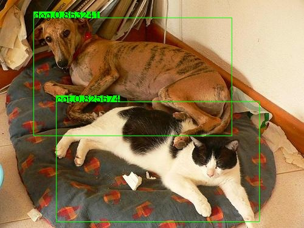

# MobileNet-YOLO Caffe

## MobileNet-YOLO 

A caffe implementation of MobileNet-YOLO (YOLOv2 base) detection network, with pretrained weights on VOC0712 

Network|mAP|Resolution|Download|NetScope|
:---:|:---:|:---:|:---:|:---:
MobileNet-YOLO-Lite|0.675|416|[deploy](models/yolov2/)|[graph](http://ethereon.github.io/netscope/#/gist/11229dc092ef68d3b37f37ce4d9cdec8)
MobileNet-YOLOv3-Lite|0.737|416|[deploy](models/yolov3/)|[graph](http://ethereon.github.io/netscope/#/gist/f308433ad8ba69e5a4e36d02482f8829)|
MobileNet-YOLOv3-Lite|0.717|320|[deploy](models/yolov3/)|[graph](http://ethereon.github.io/netscope/#/gist/f308433ad8ba69e5a4e36d02482f8829)|

## Windows Version

[Caffe-YOLOv2-Windows](https://github.com/eric612/Caffe-YOLOv2-Windows)

### Oringinal darknet-yolov3

[Converter](models/darknet_yolov3) 

test on coco_minival_lmdb (IOU 0.5)

mAP|Resolution|Download|NetScope|
:---:|:---:|:---:|:---:
53.9|416|[caffemodel](https://drive.google.com/file/d/12nLE6GtmwZxDiulwdEmB3Ovj5xx18Nnh/view?usp=sharing)|[graph](http://ethereon.github.io/netscope/#/gist/59c75a50e5b91d6dd80a879df3cfaf55)

## Performance

Compare with [YOLOv2](https://pjreddie.com/darknet/yolov2/) , I can't find yolov3 score on voc2007 currently 

Network|mAP|Weight size|Inference time (GTX 1080)|Inference time (i5-4440)
:---:|:---:|:---:|:---:|:---:
MobileNet-YOLOv3-Lite|0.717|20.3 mb|6 ms (320x320)|150 ms
MobileNet-YOLOv3-Lite|0.737|20.3 mb|11 ms (416x416)|280 ms
Tiny-YOLO|0.57|60.5 mb|N/A|N/A
YOLOv2|0.76|193 mb|N/A|N/A

Note :  the yolo_detection_output_layer not be optimization , and the deploy model was made by [merge_bn.py](https://github.com/chuanqi305/MobileNet-SSD/blob/master/merge_bn.py)

## Other models

You can find non-depthwise convolution network here , [Yolo-Model-Zoo](https://github.com/eric612/Yolo-Model-Zoo.git)

network|mAP|resolution|macc|param|
:---:|:---:|:---:|:---:|:---:|
PVA-YOLOv3|0.703|416|2.55G|4.72M|
Pelee-YOLOv3|0.703|416|4.25G|3.85M|

### CMake Build

[Caffe page](http://caffe.berkeleyvision.org/installation.html#compilation) , [dependency](https://docs.google.com/document/d/1n-WVIOrqadoIiRD-PW7RGb5LKOKP0y0Pms7svbZ3Zqw/edit?usp=sharing)

```
> git clone https://github.com/eric612/MobileNet-YOLO.git 
> cd $MobileNet-YOLO_root/
> mkdir build
> cd build
> cmake ..
> make -j4
```

## Training 

Download [lmdb](https://drive.google.com/open?id=19pBP1NwomDvm43xxgDaRuj_X4KubwuCZ)

Unzip into $caffe_root/ 

Please check the path exist "$caffe_root\examples\VOC0712\VOC0712_trainval_lmdb" and "$caffe_root\examples\VOC0712\VOC0712_test_lmdb"

Download [pre-trained weights](https://drive.google.com/file/d/141AVMm_h8nv3RpgylRyhUYb4w8rEguLM/view?usp=sharing) , and save at $caffe_root\model\convert

```
> cd $caffe_root/
> sh train_yolo.sh
```


## Demo

```
> cd $caffe_root/
> sh demo_yolo_lite.sh
```
If load success , you can see the image window like this 




## License and Citation

Caffe is released under the [BSD 2-Clause license](https://github.com/BVLC/caffe/blob/master/LICENSE).
The BAIR/BVLC reference models are released for unrestricted use.

Please cite Caffe in your publications if it helps your research:

    @article{jia2014caffe,
      Author = {Jia, Yangqing and Shelhamer, Evan and Donahue, Jeff and Karayev, Sergey and Long, Jonathan and Girshick, Ross and Guadarrama, Sergio and Darrell, Trevor},
      Journal = {arXiv preprint arXiv:1408.5093},
      Title = {Caffe: Convolutional Architecture for Fast Feature Embedding},
      Year = {2014}
    }
